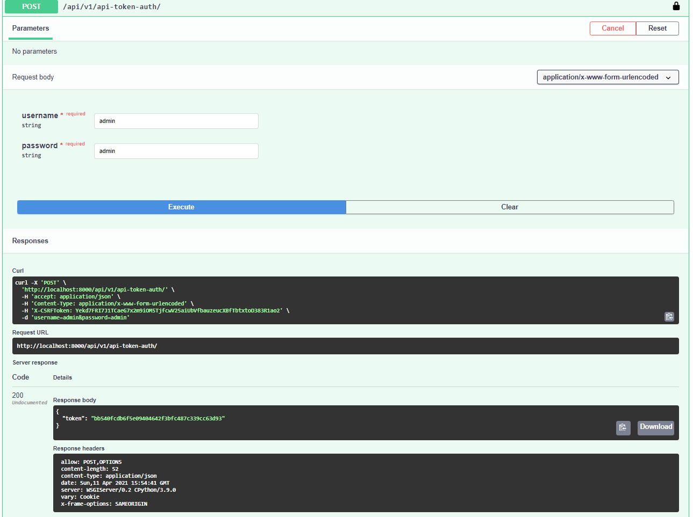

<style>
i { color: grey;}
</style>

# Survey

## Создание виртуального окружения

```
python -m venv fabrique
```

## Активация виртуального окружения

### На Linux

```
source fabrique/bin/activate
```

### На Windows

```
fabrique\fabrique\Scripts\activate.bat
```

## Установка зависимостей

```
cd survey

python -m pip install -r requirements.txt
```

## Запуск приложения

1. Создание бд для проекта.

```
python manage.py migrate
```

2. Создание пользователя для управления опросами.

```
python manage.py createsuperuser
>> Username (leave blank to use 'fabrique'): staff [ENTE
>> Email address: [ENTER]
>> Password: *** [ENTER]
>> Password (again): *** [ENTER]
Superuser created successfully
```

3. Запуск сервера.

```
python manage.py runserver
```

## Получения списка api

### URL списка api

[Swagger ui](http://localhost:8000/swagger-ui)

### Авторизация

#### Получение токена



#### Авторизация

В поле Value введите значение в виде

> `Token <token>`


### Создание пользователя

`/api/v1/user/`


## Короткое руководство по API

### Список опросов

<hr>

`GET`

> /api/v1/surveys/


**Доступно**

`Админ | Пользователь`

Пример ответа:

```
HTTP 200 OK
Allow: GET, POST, HEAD, OPTIONS
Content-Type: application/json
Vary: Accept

[
    {
        "id": 1,
        "fields": [
            {
                "id": 3,
                "choises": [],
                "field_type": "TEXT",
                "question": "fdgdfg",
                "survey": 1
            }
        ],
        "name": "string",
        "start_date": "2021-04-11",
        "end_date": "2021-04-11",
        "description": "string"
    },
    {
        "id": 3,
        "fields": [
            {
                "id": 1,
                "choises": [],
                "field_type": "TEXT",
                "question": "asdadasdasd",
                "survey": 3
            },
            {
                "id": 2,
                "choises": [
                    {
                        "id": 1,
                        "value": "here",
                        "field": 2
                    },
                    {
                        "id": 4,
                        "value": "sdfsdf",
                        "field": 2
                    }
                ],
                "field_type": "MULTIPLE",
                "question": "Where is ur mommy",
                "survey": 3
            }
        ],
        "name": "My Main Survey",
        "start_date": "2021-04-11",
        "end_date": "2021-04-12",
        "description": "Little description"
    },
]
```

### Добавление опроса

<hr>

`POST`

> /api/v1/surveys/


**Доступно**

`Админ`

Поля:
- `name`<span style="color:red">*</span>: Строка, до 150 символов <i>Заголовок опроса</i>
- `end_date`<span style="color:red">*</span>: Дата в формате YYYY-MM-DD <i>Дата завершения опроса</i>
- `description`<span style="color:red">*</span>: Текст <i>Описание опроса</i>


**Добавление поля в опрос**

`POST`

> /api/v1/surveys_field/


**Доступно**

`Админ`

Поля:
- `survey`<span style="color:red">*</span>: Целое число <i>ID опроса</i>
- `question`<span style="color:red">*</span>: Строка,  <i>Вопрос</i>
- `field_type`<span style="color:red">*</span>: "TEXT" | "SINGLE" | "MULTIPLE" <i>Тип поля: ответ текстом, ответ с выбором одного варианта, ответ с выбором нескольких вариантов</i>


### Добавление опроса

<hr>

`POST`

> /api/v1/surveys/


**Доступно**

`Админ`

Поля:
- `name`<span style="color:red">*</span>: Строка, до 150 символов <i>Заголовок опроса</i>
- `end_date`<span style="color:red">*</span>: Дата в формате YYYY-MM-DD <i>Дата завершения опроса</i>
- `description`<span style="color:red">*</span>: Текст <i>Описание опроса</i>


### Добавление значения в поля типа MULTIPLE или SINGLE

<hr>

`POST`

> /api/v1/surveys_field_choise/


**Доступно**

`Админ`

Поля:
- `field`<span style="color:red">*</span>: Целое число <i>ID Поля</i>
- `value`<span style="color:red">*</span>: Строка, до 255 символов <i>Одно из значений поля</i>

### Добавление опроса

<hr>

`POST`

> /api/v1/surveys/


**Доступно**

`Админ`

Поля:
- `name`<span style="color:red">*</span>: Строка, до 150 символов <i>Заголовок опроса</i>
- `end_date`<span style="color:red">*</span>: Дата в формате YYYY-MM-DD <i>Дата завершения опроса</i>
- `description`<span style="color:red">*</span>: Текст <i>Описание опроса</i>


### Список пройденных опросов

<hr>

`GET`

> /api/v1/answer/


**Доступно**

`Админ | Пользователь`

**Параметры поиска**

`user_id` (<i>необязательный параметр</i>)
> получение пройденных пользователем опросов с детализацией по ответам (что выбрано) по ID уникальному пользователя.

**Замечание**

Опросы заполненные с флагом `anon=True` видны только пользователю, котороый прошёл опрос.

Пример ответа:

```HTTP 200 OK
Allow: GET, POST, HEAD, OPTIONS
Content-Type: application/json
Vary: Accept

[
    {
        "id": 25,
        "fields": [
            {
                "survey_field": 4,
                "value": null,
                "text_field": {
                    "value": "answer here"
                }
            },
            {
                "survey_field": 5,
                "value": 7,
                "text_field": null
            }
        ],
        "anon": true,
        "user": 4,
        "survey": 5
    },
    {
        "id": 27,
        "fields": [
            {
                "survey_field": 1,
                "value": null,
                "text_field": {
                    "value": "123"
                }
            },
            {
                "survey_field": 2,
                "value": 3,
                "text_field": null
            }
        ],
        "anon": false,
        "user": 7,
        "survey": 3
    },
    {
        "id": 29,
        "fields": [
            {
                "survey_field": 6,
                "value": 8,
                "text_field": null
            },
        ],
        "anon": false,
        "user": 7,
        "survey": 4
    }
]
```

### Добавление опроса

<hr>

`POST`

> /api/v1/surveys/


**Доступно**

`Админ`

Поля:
- `survey`<span style="color:red">*</span>: Целое число <i>ID опроса</i>
- `fields`<span style="color:red">*</span>: Список элементов [AnswerField](1) <i>Дата завершения опроса</i>

[1]:
## AnswerField

| Поле        | Тип           | Описание  |
| ------------- |:-------------:| -----:|
| survey_field      | Целое число | ID поля в опросе `survey` |
| value     | Целое число       |  <span style="color:red">*</span>Обязательно для заполнения для `survey_field` с типом поля **MULTIPLE** или **SINGLE**  |
| text_field | [AnswerTextField](2)     |    <span style="color:red">*</span>Обязательно для заполнения для `survey_field` с типом поля **TEXT**|

[2]:

## AnswerTextField

| Поле        | Тип           | Описание  |
| ------------- |:-------------:| -----:|
| value     | Текст      | Текстовый ответ для `survey_field` с типом поля **TEXT** |